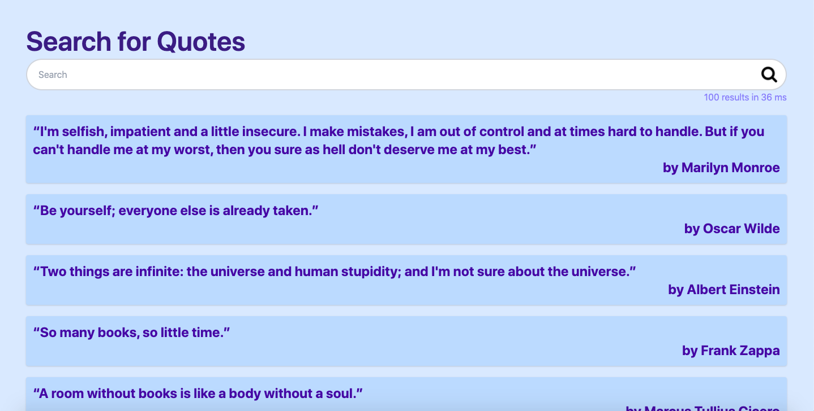

[](https://opensource.org/licenses/MIT)
[](https://GitHub.com/Naereen/StrapDown.js/graphs/commit-activity)
[](https://GitHub.com/Naereen/ama)
[](https://code.visualstudio.com/)
[](https://GitHub.com/saswatamcode/search_engine/network/)
[](https://GitHub.com/saswatamcode/search_engine/stargazers/)
[](https://GitHub.com/saswatamcode/search_engine/issues/)
[](https://github.com/ellerbrock/open-source-badges/)

# Quote Search Engine
This is a search engine built using [Go](https://golang.org/) and [Elasticsearch](https://www.elastic.co/elastic-stack).

<div align="center">
		
</div>

## How it works
It functions by scraping quotes from [Goodreads](https://www.goodreads.com/quotes/) and indexing the data into elasticsearch. With elasticsearch's robust text analysis capabilities, the data can then be queried. Here, we simply query based on the content of a quote or the name of the author. This application has both CLI and web UI for search and indexing operations.

## Dependencies
- github.com/gocolly/colly v1.2.0: For web scraping
- github.com/olivere/elastic/v7 v7.0.22: For interacting with elasticsearch
- github.com/spf13/cobra v1.1.1: For CLI
- github.com/sirupsen/logrus v1.2.0: For server logs
- Next.js v10 and Tailwind v2: For frontend web app

## Get Started
- Clone into repo
- Install elasticsearch and start service. Using [homebrew](https://brew.sh/) simply run,
```
brew install elasticsearch
elasticsearch
```
- Using CLI, index data by, (for indexname and number of quotes to be indexed you can pass in flags) 
```
go run main.go index
```
- Search with CLI,
```
go run main.go search Mark Twain
```
OR
- Search with UI, by first starting server,
```
go run main.go server
```
- Then start frontend,
``` 
cd web-ui
yarn
yarn start
```
[](https://forthebadge.com)
[](https://forthebadge.com)
